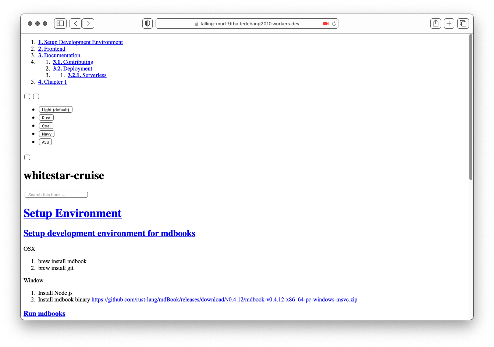

# Deployment on Black Blaze & Cloudflare

## Blackblaze

1. Create a b2 bucket
   - Only create the bucket with valid URL characters `ABCDEFGHIJKLMNOPQRSTUVWXYZabcdefghijklmnopqrstuvwxyz0123456789-._~:/?#[]@!$&'()*+,;=`
   - `-` char does not seem to work
   - Make the bucket public
2. Upload the files

### Issues
The javascript and css does not seem to be loaded properly



## Cloudflare

1. Create a cloudflare worker
2. Add this script below

```javascript
// Improved the script from this blog https://www.grahn.io/posts/2020-02-08-s3-vs-b2-static-web-hosting/
// Backblaze Url
const baseURL = "https://f000.backblazeb2.com/file/BUCKETNET"
addEventListener('fetch', event => {
event.respondWith(handleRequest(event))
})
async function handleRequest(event) {
// only allow get requests
if (event.request.method !== 'GET') {
return new Response('Method not allowed', { status: 405 })
}
// return a cached response if we have one
const cache = caches.default
let cachedResponse = await cache.match(event.request)
if (cachedResponse) {
return cachedResponse
}
const parsedUrl = new URL(event.request.url)
let path = parsedUrl.pathname
// check if a file or folder and 301 when tailing slash is missing
let lastSegment = path.substring(path.lastIndexOf('/'))
if (lastSegment.indexOf('.') === -1) {
if (!lastSegment.endsWith('/')){
return Response.redirect('https://' + parsedUrl.hostname + path + '/', 301)
} else {
path += 'index.html'
}
}
// fetch content from B2
const b2Response = await fetch(`${baseURL}${path}`)
// add some headers
const headers = {
'cache-control': 'public, max-age=14400',
'content-type': b2Response.headers.get('Content-Type')
}
const response = new Response(b2Response.body, { ...b2Response, headers })
// all is well, return the response
if (response.status < 400){
event.waitUntil(cache.put(event.request, response.clone()))
return response
} else if (response.status == 404){
// return error page
return fetch(baseURL + "/404.html")
}
// return minimal error page
if (response.status > 399) {
return new Response(response.statusText, { status: response.status })
}
}
```
