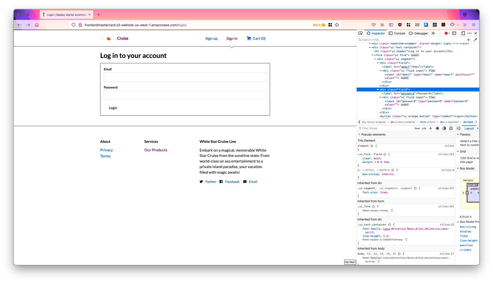

# Frontend Testing

## login input fields

```html
<div class="field">
    <label for="email">Email</label>
    <div class="ui fluid input">
        <input type="email" id="email" name="email" autofocus="" value="">
    </div>
</div>
<div class="field">
    <label for="password">Password</label>
    <div class="ui fluid input">
    <input type="password" id="password" name="password" value="">
    </div>
</div>
<button type="submit" class="ui orange button">Login</button>
```

## Request
```json
{
    "data": {"email":"example@example.com","password":"password","type":"token"}
}
```




### Issues
CORS is required because the page uses JSON post

Live Website: <http://frontendmastercard.s3-website-us-west-1.amazonaws.com/login/>